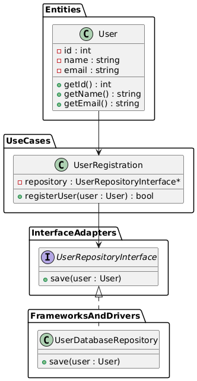

# Architecture Fundamentals Clean Architecture

Clean Architecture is a software design philosophy introduced by Robert C. Martin (Uncle Bob), which emphasizes decoupling software components to achieve a system that is more flexible, scalable, and maintainable. It organizes code to separate core business logic from delivery mechanisms, facilitating code that is independent of frameworks, UI, databases, or other external details. This architecture is especially popular in large systems or projects requiring resilience and easy adaptability to changes, as it fosters high cohesion and low coupling within the software layers.

## Key Principles of Clean Architecture

1. **Independence:** Each layer in the architecture is independent of the others. Core business logic does not rely on infrastructure or user interfaces.
2. **Testability:** The architecture promotes unit and integration testing, as the business logic is isolated and testable without needing to rely on external factors.
3. **Ease of Maintenance:** By separating concerns into distinct layers, updates to one layer don’t cascade unwanted changes into others.
4. **Framework Independence:** The design does not rely on any specific framework or tool, allowing flexibility to adopt new technologies with minimal refactoring.

## Clean Architecture Structure

1. **Entities:** These represent the core business logic or domain model. They are pure, self-contained, and do not depend on anything external.
2. **Use Cases:** Contains the application's specific business rules and orchestrates the flow of data to and from the entities.
3. **Interface Adapters:** Responsible for converting data from the format most convenient for use cases and entities to the format most convenient for external frameworks, databases, and UI.
4. **Frameworks and Drivers:** Outermost layer, including the database, UI, or other services like APIs and message brokers.

## Advantages of Clean Architecture

- **Modularity and Reusability:** Components are well-separated, making individual components reusable in other projects or modules.
- **Testability:** Independent layers make it easier to write tests for each part without relying on external systems.
- **Scalability:** Clean Architecture allows for adding new functionalities with minimal impact on the existing system.
- **Maintainability:** Separation of concerns simplifies maintenance, making it easier to locate, isolate, and fix issues.

## Where it is Used

Clean Architecture is widely used in applications that require:

- High modularity and separation of concerns, such as in microservices or serverless architectures.
- Scalability and flexibility to incorporate new technologies and frameworks.
- Robust test coverage and dependency isolation, common in industries like finance, healthcare, or large-scale software systems.

## Implemantation in C++

User Management System using Clean Architecture principles in C++. This example will involve user registration and storage, where a User entity represents a core part of the system, and the user management logic is encapsulated in a use case for registration.

### Structure and Components

We'll structure the system as follows:

1. **Entities:** User - Represents the user’s core attributes.
2. **Use Cases:** UserRegistration - Handles business logic for registering users.
3 **Interface Adapters:** UserRepositoryInterface - Interface for saving users.
4. **Frameworks and Drivers:** UserDatabaseRepository - Concrete implementation of UserRepositoryInterface to save users to a database.

### Code Implementation in C++

**Entities**
The User entity encapsulates the user data.

```cpp
// User.h
#pragma once
#include <string>

class User {
public:
    User(int id, const std::string& name, const std::string& email)
        : id(id), name(name), email(email) {}

    int getId() const { return id; }
    std::string getName() const { return name; }
    std::string getEmail() const { return email; }

private:
    int id;
    std::string name;
    std::string email;
};
```

**Use Cases**
The UserRegistration use case handles the registration process and performs validation.

```cpp
// UserRegistration.h
#pragma once
#include "User.h"
#include "UserRepositoryInterface.h"

class UserRegistration {
public:
    UserRegistration(UserRepositoryInterface* repository)
        : repository(repository) {}

    bool registerUser(const User& user) {
        if (isValidUser(user)) {
            repository->save(user);
            return true;
        }
        return false;
    }

private:
    UserRepositoryInterface* repository;

    bool isValidUser(const User& user) {
        return !user.getEmail().empty() && !user.getName().empty();
    }
};
```

**Interface Adapters**
UserRepositoryInterface provides an abstraction for user storage.

```cpp
// UserRepositoryInterface.h
#pragma once
#include "User.h"

class UserRepositoryInterface {
public:
    virtual ~UserRepositoryInterface() = default;
    virtual void save(const User& user) = 0;
};
```

**Frameworks and Drivers**
UserDatabaseRepository provides a database-specific implementation for user storage.

```cpp
// UserDatabaseRepository.h
#pragma once
#include "UserRepositoryInterface.h"
#include <iostream>

class UserDatabaseRepository : public UserRepositoryInterface {
public:
    void save(const User& user) override {
        std::cout << "Saving user to database: "
                  << user.getName() << " (Email: " << user.getEmail() << ")"
                  << std::endl;
    }
};
```

**Main Function**
In the main function, we create instances of each component and register a user.

```cpp
// main.cpp
#include "User.h"
#include "UserRegistration.h"
#include "UserDatabaseRepository.h"

int main() {
    UserDatabaseRepository databaseRepository;
    UserRegistration userRegistration(&databaseRepository);

    User user(1, "Alice", "alice@example.com");
    if (userRegistration.registerUser(user)) {
        std::cout << "User registered successfully!" << std::endl;
    } else {
        std::cout << "User registration failed." << std::endl;
    }

    return 0;
}
```

### Class Diagram

